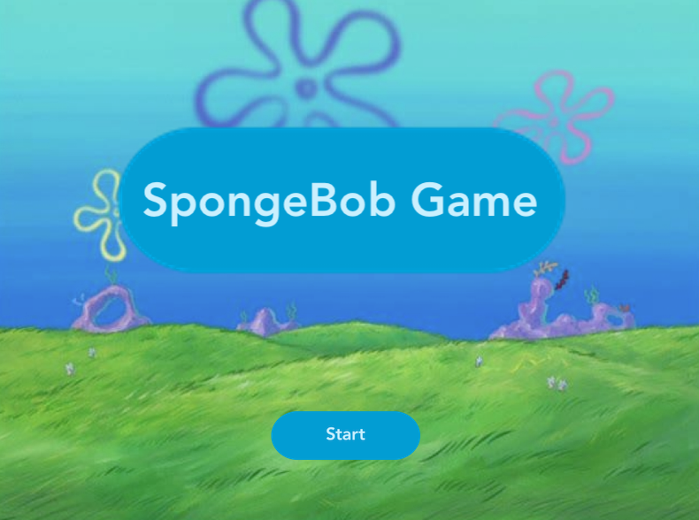
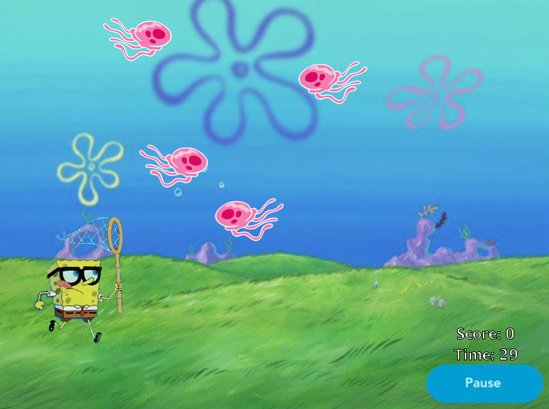
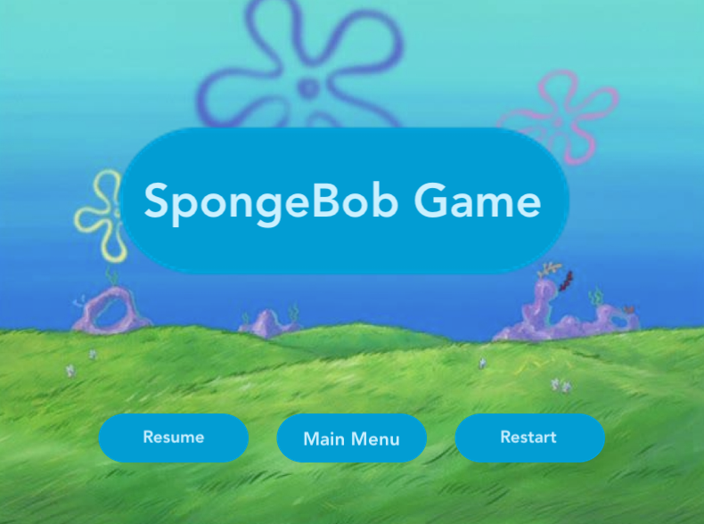
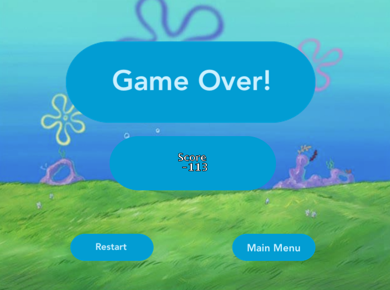

# Lab 1: Spongebob Game of Catch

## Purpose of Project

In this game, the player controls a Spongebob character. The goal of the game is to catch as many jellyfish as possible. However, as the player gains more points, the game will become more challenging. The player must avoid objects, such as boots, cans. Occasionally, Karen, a villain, will appear and Spongebob must avoid her, as well.

## How to Start Project

  1. Make sure you have cloned the GitHub repository and have pulled the most recent code.
  2. Open the project in GreenFoot.
  3. Press the `Run` button in the botton left corner to run the program.
  4. Follow the [`User Instructions`](#UserInstructions) to play the game.

## User Instructions

Spongebob is taking the day off of work and wants to spend a relaxing day jellyfishing. Help him catch the jelyfish, and make sure you avoid dangerous objects!

### Moving Spongebob

* Move Up
  * Use the up arrow key on the keyboard to move Spongebob up.
* Move Down
  * Use the down arrow key on the keyboard to move Spongebob up.
* Move Left
  * Use the left arrow key on the keyboard to move Spongebob up.
    * When Spongebob moves towards the left side of the screen, he will face the left direction.
* Move Right
  * Use the right arrow key on the keyboard to move Spongebob up.
  * When Spongebob moves towards the right side of the screen, he will face the right direction.

### Screens

#### Main Menu

When you first open the game, you will see the `Main Menu`, like the one depicted below. From this screen, you can start the game by pressing the `Start` button. This will lead you to the [`Main Game Screen`](#Main-Game-Screen).

  

#### Main Game Screen

Once you start the game, you will see the `Main Game Screen` like the one shown below. This is where you will play the game. Use the arrow keys to control Spongebob (see section [`Moving Spongebob`](#Moving-Spongebob)).

For your convenience, the score is displayed in the bottom right corner. Depending on what you do during the game, you can either gain or loose points, which will affect your overall score (see section [`Point Break Down`](#Point-Break-Down)). Underneath the score, you can also see the time (in seconds) left in the game. The game only lasts for 30 seconds, so be quick!

If you would like to pause the game, press the pause button in the bottom right corner, under the scoreboard. This will lead you to the [`Pause Screen`](#Pause-Screen).

  

#### Pause Screen

If you pause the game, you will be led to the `Pause Screen`. Here, you have the option to either resume the game, restart the game, or go to the main menu.

To resume the game, click the `Resume` button, and to restart the game, click the `Restart` button. When you press these buttons, they will lead you to the [`Main Game Screen`](#Main-Game-Screen). To go to the [`Main Menu`](#Main-Menu), press the `Main Menu` button.

  

#### End of Game Screen

When your time runs out, you will be led to the `End of Game Screen`. Here, you will see your overall score for the game. If you would like to go to the [`Main Menu`](#Main-Menu), press the `Main Menu` button. If you would like to restart the game, click the `Restart` button.

  

### How to Gain Points

In this game, depending on what object SpongeBob catches, the player will either gain or loose a certain amount of points.

Spongebob wants to catch jellyfish, so if you catch them, you will gain points. However, Spongebob doesn't want to catch any trash, like boots and cans. Make sure you avoid them, because you'll loose points. Also, watch out for Karen! She and Plankton always try to sabotage Spongebob's fun, and if you accidentially run into her, you will loose the most points.

### Point Break Down

Below, you can see the point breakdown for the game.

| Object Caught | Points Gained / Lost |
|---------------|----------------------|
| Jellyfish     | + 1 point            |
| Boot          | - 2 points           |
| Can           | - 5 points           |
| Karen         | - 15 points          |

## About

* **Author:** Madeleine Waldie
* **Last Updated:** October 3, 2018